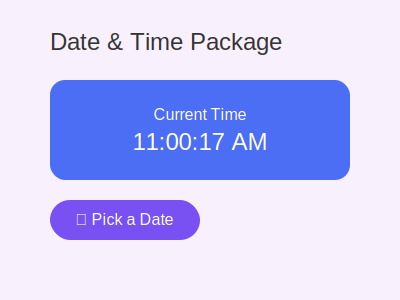

# Date & Time Manipulation Package

[](https://pub.dev/packages/date_time_manipulation)

A Flutter package that provides elegant and user-friendly widgets for date and time manipulation, including a current time display and date picker functionality.



## Features

- 🕒 **Current Time Display**: A beautiful widget that shows the current time in real-time
- 📅 **Date Picker**: An intuitive date picker widget with a modern design
- ⚡ **Real-time Updates**: Automatic updates for time display
- 🎨 **Customizable UI**: Easy to customize colors, fonts, and styles
- 📱 **Responsive Design**: Works seamlessly across different screen sizes

## Installation

Add this to your package's `pubspec.yaml` file:

```yaml
dependencies:
  date_time_manipulation: ^1.0.0
```

Then run:

```bash
$ flutter pub get
```

## Usage

### Current Time Widget

```dart
import 'package:date_time_manipulation/date_time_manipulation.dart';

TimeNowWidget(
  style: TextStyle(fontSize: 24),
  format: 'HH:mm:ss a',
)
```

### Date Picker

```dart
import 'package:date_time_manipulation/date_time_manipulation.dart';

DatePickerWidget(
  onDateSelected: (DateTime date) {
    print('Selected date: $date');
  },
)
```

## Contributing

Contributions are welcome! Please feel free to submit a Pull Request.

## License

This project is licensed under the MIT License - see the [LICENSE](LICENSE) file for details.